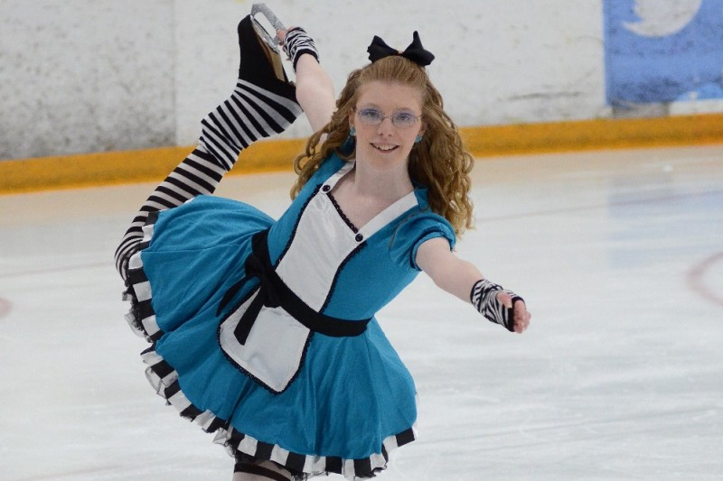
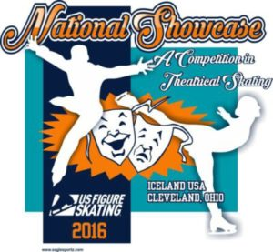
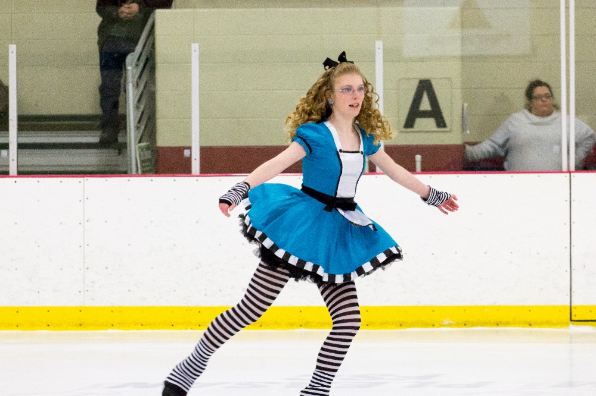

# Help Kayla Attend National Showcase

Kayla has an amazing opportunity set before her. She has qualified to compete at National Showcase , a Theatrical Figure Skating competition this August in Strongsville, Ohio. Skaters from all over the country travel to the event each year to show off their skills. Only skaters who have earned from 1st to 4th place at qualifying competitions are eligible to compete.

This competition is unique as the skaters compete under spotlights with the focus on interpretation of the story rather than just the individual elements. Skaters are encouraged to dress in costume, use props, and become their character as they perform. Kayla takes to the ice in a dramatic piece to Alice's Theme from Alice in Wonderland. She qualified to compete at Nationals at the Ann Arbor Springtime Invitational in May with the performance below.  

<iframe media_type="0" media_id="oN8ED4n8b5E" class="youtube-replace" title="YouTube video player" style="margin-bottom:20px;width:560px;height:315px;" src="//www.youtube.com/embed/oN8ED4n8b5E/?rel=0" frameborder="0" allowfullscreen="1"></iframe>

Kayla is very proud of this program. It is by far her favorite of all those she has competed with thus far.  It's been her goal all season just to qualify and now she hopes to finish up this competivite season with a strong performance at Nationals. 

National Showcase will take place on August 11 -14, 2016, at the OBM Arena Ice Land USA in Strongsville Ohio.  Kayla is trying to raise funds to help with registration and practice ice costs, as well as for travel and hotel accommodations.  She is selling some items, and working some odd jobs to help with the costs, but she could use some additional help. The registration deadline for the competition is July 13th and we are trying to make sure we have all our financial ducks in a row before we commit to taking this journey.

##A word from Kayla....

"I started skating when I was eight years old, actually as a result of the field trips my class took in second grade. It's funny because when I started skating I had no intentions of competing. Now, in my fifth year of competitions, it's what I live for. I was so happy when I landed my full jumps and moved up to Preliminary level because I knew I could finally qualify for Nationals. I promise that if I do get to go to this amazing competition, it will be my best performance thus far. :)

Thank you for any support you can give. I am so excited for this opportunity to achieve my goals."